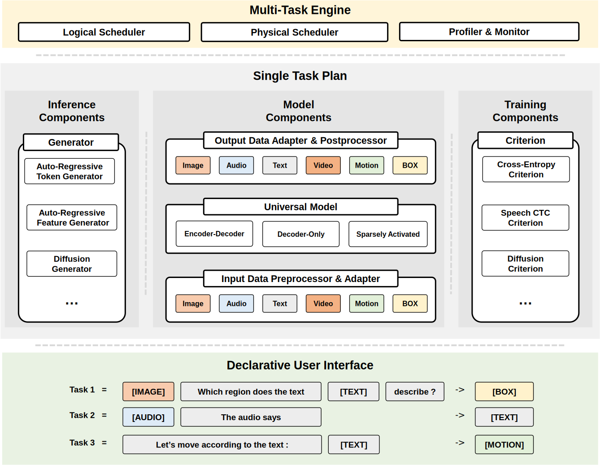

========================
Philosophy
========================

Why we need OFASys
========================

Question 1: The lack of AI systems
-----------------------------------

The great liberation of productivity in the history of Computer Science is inseparable from systematic abstract thinking.
In order to support more tasks, researchers have developed a series of systems ranging from OS and Database to MapReduce,
Pregel, Spark, Flink in the era of big data, and Pytorch in the era of AI deep learning.
These systems shield the implementation details, allowing developers to focus more on solving the actual task itself
rather than the underlying details of the system implementation, thus greatly promoting the productivity of the entire industry.
The lack of an AI learning system leads to:

* For single-task/less-task research, AI will frantically "take shortcuts", resulting in limited model combination generalization ability. Artificial priors cannot be adequately fixed by light-weight enumeration
* There is no successful system abstraction, the work of AI researchers and developers is not hierarchical, and the coordination is very poor. At present, researchers are more research segmentation at the longitudinal task level

In the fields of multi-modal and multi-tasking, this problem becomes more prominent,
and there is a lack of a set of research tools upstream and downstream for task expansion,
training and validation.

Question 2: Learning task/modality, from single to unified
--------------------------------------------------------------
A large number of previous studies were limited to a single modality/task, while the distribution of information data
received by humans is multi-modal/multi-tasking.
Each task is studied and trained individually, ignoring the synergy and generalization ability among individual tasks.
The success of GPT has revealed the importance of our Scalability, which has been extensively studied, including Model Size Scalability and Data Scalability.
In addition, OFASys hopes to further achieve Task Scalability on multimodal tasks.

The Goal of OFASys: Towards Building a Systematic Multi-modal Multi-task AI
----------------------------------------------------------------------------

* Build and reshape the learning & research methods of multi-modal general AI with systematic thinking.
  The system provides different levels of abstraction to provide isolation, including unified task representation,
  IO conversion, learning mechanism, and computing engine. The development process for specific tasks is converted into
  a development process for unified task description interfaces (similar to mpi->MR).
* Through the abstract interface provided by such a system, taking our practice as a starting point, driving the power
  of the community, and realizing the generalization ability of a model on general and unknown tasks by covering a
  sufficient variety of multi-modal AI tasks.

What does OFASys offer you
===============================

OFASys provides a convenient interface, architectures, tools, and system support
for multi-modal multi-task workload, trying to shift parts of the attention
from building task-specific architectures, IO, and learning paradigms towards
finding whether it’s possible to understand generally how to manage data through
multi-modal multi-task learning.

Declarative Multi-Modal Task Programming Interface
-------------------------------------------------------

OFASys provides a declarative language, referred to as multi-modal instruction,
for writing a universal multi-modal task description. We wish users can write a
multi-modal task without diving into its implementation details by default, just
like we can write SQL to process a distributed job without knowing its execution
details.

- Illustration 1. Image Captioning::

    [IMAGE:img] what does the image describe? -> [TEXT:cap]

- Illustration 2. MNLI Task in Glue Benchmark::

    can text1 [TEXT:sent1] imply text2 [TEXT:sent2]? -> [TEXT:label,closed_set]

    # Or we can use the prompt tuning which prepends some text prompts to decoder.
    can text1 [TEXT:sent1] imply text2 [TEXT:sent2]? ->  can text1 [TEXT:sent1,no_loss] imply text2 [TEXT:sent2,no_loss]? [TEXT:label,closed_set]

- Illustration 3. Object Detection Task with variable-length output ::

    [IMAGE:img] detect the objects in the image. -> [[BOUNDING_BOX] [TEXT]]*

- Illustration 4. Interleaved Image Text context with variable-length pairs::

    -> ([IMAGE] [TEXT])*

Given an OFASys model, we can perform inference on a zero-shot task, as follows.

.. code:: python

    >>> model = OFASys.from_pretrain('OFASys.ckpt')
    >>> sample = Instruction(
    ...     "[IMAGE] what does the region describe in the image? region: [BOUNDING_BOX] -> [TEXT]"
    ... ).format(
    ...     image_data, box_data
    ... )
    >>> text = model.inference(sample)

Unify Model and Modality-Specific Components
----------------------------------------------

To learn by a single task, OFASys will parse its instruction into several modality slots, and generate their task
configurations, which can be regarded as an execution logical plan from a database perspective. This plan, specifies the
specific preprocessor, input and output adaptor, criterion, and postprocessor within each single modality slot. We also
manage a task- and modality-agnostic computation model, which takes as input an embedding sequence and produces
an embedding sequence.
Modality adaptors convert between raw modality data and the input or output of the universal model.
Users can also overwrite and implement their criteria and adaptors using our advanced interface.

|

|

Task-Scalable Joint Training
--------------------------------

OFASys provides a convenient mechanism for joint training multiple tasks.
Users only need to define a single task, typically consisting of a mixup of 
the dataset, instruction, criterion, runtime arguments, etc.
And it can be added to the multi-task scheduler for joint training.
Different tasks are decoupled, and only model parameters are shared.
The user can flexibly define when the task joins or leaves the co-training scheduler,
which provides great convenience.

How to schedule the tasks in multi-task learning to maximize task cooperation and minimize task interference is an active research area.
For now, OFASys implements basic schedulers, such as gradient accumulation across all tasks and round-robin across tasks,
which avoids memory accumulation of activation of different tasks.
Nonetheless, the existence of the abstraction of multi-task schedulers allows users to compose their own schedules.

