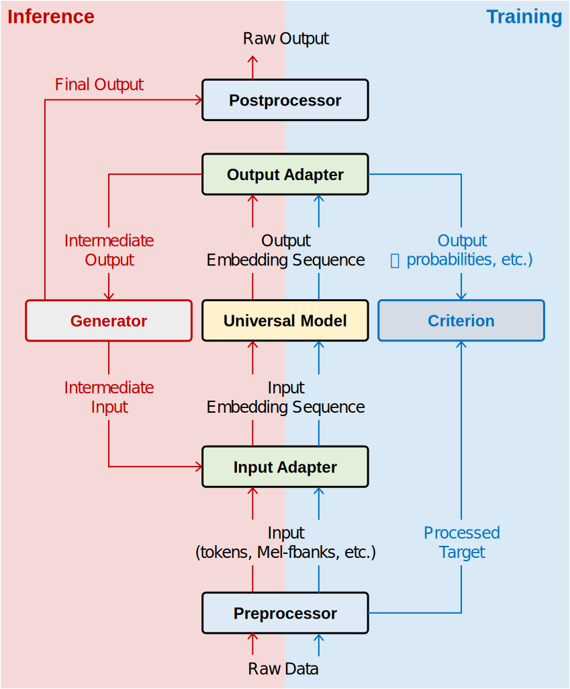

=============
Core Concepts
=============

|

|

Overview
------------------
OFASys proposes a declarative interface, named :ref:`Instruction<anchor_instruction>`, to describe a multi-modal task.
For a `Modality`_ of raw input data *x* of type *T* in a given :ref:`Slot<anchor_slot>` *S*,
OFASys parses the task logical plan about *T*'s `Preprocessor`_ and `InputAdaptor`_,
first converts input data into proper forms, feeds to the corresponding `InputAdaptor`_, then produces an embedding sequence.
The `Universal Computation Model`_ receives an embedding sequence and outputs another.
Note that, compute engine is kept clean by not aware of the concept of vocabulary, neither the loss function nor the optimization strategy.
The output embedding sequence is then fed into `Loss Criterion`_,  or `OutputAdaptor`_ and `PostProcessor`_ to generate raw data output.
A user may hand-craft such plans for each task, or just let OFASys perform automatic logical planning, i.e., default settings among many choices,
in the very first version of our system.

.. _anchor_instruction:

Instruction
-------------------
Considering the balance between understanding and generation tasks and models,
the instruction follows a sequence-to-sequence normative.
An instruction consists of two “sentences” connected by a virtual separator “->” (by virtual, we mean the separator is not part of the model input or output),
of which the sentence before the separator specifies the content of the encoder and the sentence after, the decoder.
A sentence contains multiple segments, each of which is either “plain text” describing the task goal at hand or a “slot” describing the task data.
Although each sentence with content must contain at least one slot, it is permitted to use an empty sentence to represent an encoder-only or a decoder-only model.

The multi-modal instruction grammar is formalized below,

.. code-block:: console

       instruction:  sentence->sentence
          sentence:  (plain_text|meta_slot)+
         meta_slot:  slot|expanded_pattern
              slot:  \[type(:name)?(,attribute)*\]
         attribute:  (key(=value)?)*
    name,key,value:  [_A-Za-z0-9]+

Terms
^^^^^^^^^^^^^^^^^^^^

Instruction
********************

    An **Instruction** is made of two **Sentences** connected with a symbol of "->".

Note::

     The arrow is neither the input nor the output of the system.
     It is for the system to identify encoder slots from decoder slots.

Sentence
********************

    The term **Sentence** in OFASys indicates a multi-modal task layout.
    A **Sentence** may contain several plain text tokens as the task description or helper prompts,
    and at least one **Slot** that stands for input or output of some specified modality.

.. _anchor_slot:

Slot
********************

    A slot, identified by square brackets from plain text segments, is the basic processing unit of OFASys.
    Each slot contains only one modality of data that spans consecutive positions.
    A **Slot** consists of a **Type**, a **Name**, and optional **Attributes** of **key=value** pairs.
    Given different positions that appeared in the instruction, we denote the slot that appears in the encoder and decoder sentence by **E-slot** and **D-slot**, respectively.
    We will introduce how **Slot** is associated with adaptors and preprocessors in later sections.

Name
********************

    A **Name** is used to refer to the input or output column index,
    while we provide several **attr** arguments such as ``no_loss``, ``closed_set``, ``is_label`` to achieve typical control over the sequence in training or inference.
    OFASys provides several built-in attribute and also enables user-defined attribute interface.

Expanded Pattern
********************

    The expanded pattern allows the system to register more syntax on the instruction.
    There are some typical patterns in OFASys working in progress, eg, the **interleaved_pattern** and the **contrastive_pattern**.

.. code-block:: console

    expanded_pattern:  interleaved_pattern|contrastive_pattern
    interleaved_pattern:  \[slot+\]\*
    contrastive_pattern:  \[slot\|slot\]

.. _anchor_modalities:

Modality
-------------------
**Modality** describes a class of raw data distributions from a human perspective. It usually corresponds to a group of pre - and post-processing methods of data. In OFASys, there are five main modes: *TEXT*, *IMAGE*, *AUDIO*, *VIDEO*, *MOTION*, and two affiliated modalities: *BOX*, *PHONE*. Each modality has its own preprocessors and IO adapters.

- *TEXT*: Texts of all languages.
- *IMAGE*: Visual-spatial data in different formats, such as jpg, and png.
- *AUDIO*: Audio of all formats, such as music and vocals, type of fbank or wave.
- *VIDEO*: Consecutive image frames extracted from a video, i.e., tempo-spatial data.
- *MOTION*: Motion modality is common in 3D character animation, robotics, and human behavior understanding.
- *BOX*: Bounding box (bbox) indicates the position of an object in an image that happens to contain the object,
- *STRUCT*: Structural data, such as databases, tables, grids, graphs, and trees (for now, only supports databases and tables), is widely used in many areas, e.g., knowledge graphs and protein structure.

Preprocessor
-------------------
**Preprocessor** provide the ability to convert data from raw format to tensor format. OFASys provides implementations of
commonly used preprocessors, e.g. text tokenizers, and image transforms, as default choices.
As we use an encoder-decoder transformer as the default Universal Computation Model, our basic idea in designing these preprocessors is to transform
the raw input into sequences of discrete tokens.
For more details, see :doc:`../api/preprocessor`.

InputAdaptor
------------------
**InputAdaptor** takes corresponding data in tensor format as input and then outputs sequences in the same format, called **AdaptorOutput**.
**AdaptorOutput** contains not only embedding sequences, but also some additional tensors, ranging from position embedding to self attention bias matrix.
**AdaptorOuptuts** from different slots will be contacted by OFASys before being fed into the computation model.
For input data that has been converted to discrete tokens, simple lookup embedding are used as adaptors.
For other forms of input data, adaptors are willing to transform data into a sequence of features.
For more details, see :doc:`../api/adaptor`.

Universal Computation Model
-----------------------------
By default, considering the simplicity and the modality scalability, OFASys chooses an encoder-decoder Transformer as the back-end universal computation engine, which is agnostic to both task and modality.
The computation model takes the concatenated **AdaptorOutput** as input and performs multi-modal information fusion through self-attention and cross-attention, without awareness of how raw inputs are embedded in adaptors.
Post-attention layer normalization and head scaling are added for stable training.

OutputAdaptor
----------------------
After computation in the model, an **OutputAdaptor** takes the hidden states from the model as input,
and converts them back into the original forms of that modality with the help of **Postprocessor**.
To keep the **InputAdaptors** and the **OutputAdaptors** used in pairs, we use two methods in the
same class to represent a pair of IO adaptors (``forward()`` for **InputAdaptor** and ``forward_output()``
for **OutputAdaptor**).
For more details, see :doc:`../api/adaptor`.

PostProcessor
-----------------------
*Postprocessors* are used when we need to convert model output data to raw input data for evaluation or visualization.
Generally, postprocessors only perform an inverse process of what preprocessors do.
In practice, we usually treat the method ``decode()`` in the *Preprocessor* class as the corresponding postprocessor to make sure they are used in pairs.
For more details, see :doc:`../api/preprocessor`.

Loss Criterion
-----------------------
OFASys learns models by regular backpropagation, and we need to specify the loss criterion for a given task.
A criterion receives the output of both IO adaptors.
We have two different criterion views, a slot-centric view that is slot-specific and a global view that is visible to all slots.
By such fine-grained granularity control over different slots, we can simultaneously support autoregressive models, diffusion models, etc., for different slots.
Both E-slot and D-slot may contain optimization objectives. For example, CTC loss that is commonly considered in the ASR task for speech models can be declared within E-slot.
For more details, see :doc:`../api/criterion`.

Generator
----------------------
During inference, most tasks require more than one forward to generate a complete sequence, so generators that control the generation workflows are of vital importance.
As our model follow the encode-decoder architecture used in OFA, we use a sequence-to-sequence generator as the default generator.
Unlike the **InputAdaptor** whose behavior is only determined by the modal input and the task instruction, there are probably constraints, e.g., priors or restricted option candidates in the generation stage that may either improve the performance or meet the task requirements.
For example, a generative pretrained model needs to restrict its generation output space to the target label set for a classification task, where we add a ``closed\_set`` attribute in the slot。
In OFASys, we provide a non-parametric Trie tree decoder to handle restricted outputs, as in OFA. Users can also implement other strategies as alternative plugins.
For more details, see :doc:`../api/generator`.
